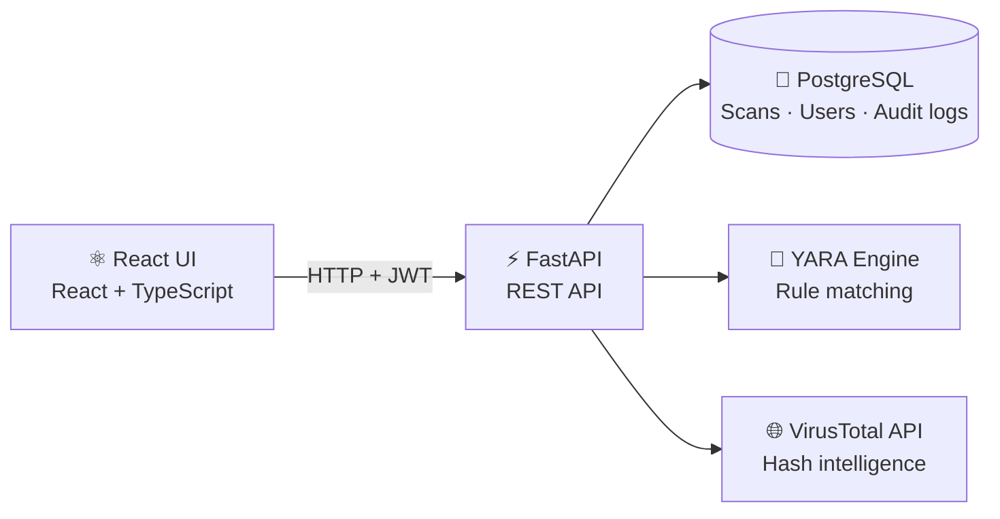
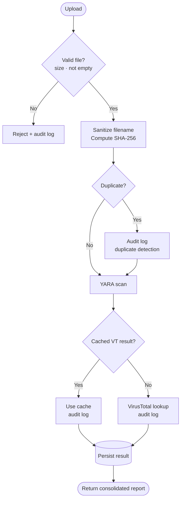

<div align="center">
# 🛡️ SentinelX
 
### Malware Analysis & Threat Intelligence Platform
 
**Upload a file. Get a verdict.** SentinelX combines YARA detection, VirusTotal enrichment, and an auditable scan history in a secure, full-stack web platform.


 
</div>
---
 
## 📖 Overview
 
SentinelX is a production-oriented malware analysis platform built to demonstrate secure backend engineering, malware detection workflows, threat intelligence enrichment, authentication and authorization, auditability, and a modern security-focused frontend.
 
Each uploaded file produces a consolidated report containing:
 
| Signal | Description |
| --- | --- |
| 🔑 **File identity** | SHA-256 hash for integrity and deduplication |
| 🧬 **YARA detections** | Matched rules and malware classification |
| 🌐 **VirusTotal intelligence** | Detection statistics, reputation, and last analysis time |
| 📊 **Scan metadata** | Status, timestamps, and persistent history |
 
Role-based administrative access and security audit logging provide the oversight layer expected of a real analyst platform.
 
<!--
📸 SCREENSHOTS
Add screenshots here to make the README stand out, for example:
<p align="center">
  
  
</p>
-->
 
---
 
## ✨ Features
 
### 🧪 Malware Analysis
 
- Secure file upload with a configurable maximum size
- Empty-file rejection and filename sanitization
- SHA-256 hashing and **duplicate file detection**
- **YARA-based detection** with matched-rule reporting
- Scan status tracking and persistent scan records
### 🌐 VirusTotal Intelligence
 
- SHA-256 based hash lookups
- Persisted results with detection statistics, reputation, and last-analysis timestamp
- **Result caching** to avoid unnecessary external lookups
- Graceful degradation when VirusTotal is unavailable
### 🔐 Authentication & Authorization
 
- JWT-based authentication with secure password hashing
- Registration, login/logout, and a current-user endpoint
- Protected application routes on the frontend
- **Role-based access control** with superuser-only audit access
- **Cross-user scan isolation**
### 📜 Security Audit Logging
 
Security-sensitive events are recorded for administrative review:
 
| Category | Events |
| --- | --- |
| **Authentication** | Successful logins, failed logins |
| **Scanning** | Scan uploads, duplicate detections, rejected uploads |
| **Threat intel** | VirusTotal lookups, VirusTotal cache usage |
| **Access control** | Unauthorized administrative access attempts |
 
### 📊 Dashboard, History & Details
 
- Total, malicious, and clean scan counts at a glance
- Recent activity with clear status indicators
- Manual refresh with non-blocking UI state
- Per-user scan history with drill-down to full scan details (hash, YARA detections, VirusTotal intelligence)
### 🎨 Frontend Experience
 
- Responsive layout and navigation
- Keyboard-accessible interactive elements and accessible form controls
- Accessible status and error messages
- Clear loading and error states
- Dedicated 404 page
---
 
## 🏗️ Architecture
 

 
### Scan Pipeline
 

 
---
 
## 🧰 Tech Stack
 
| Layer | Technologies |
| --- | --- |
| **Backend** | Python 3.13 · FastAPI · SQLAlchemy 2 · PostgreSQL · Alembic · Pydantic · Passlib · JWT |
| **Detection & Intel** | YARA · VirusTotal API |
| **Frontend** | React 19 · TypeScript · Vite · Tailwind CSS · React Router · Axios · React Hook Form · Zod · Lucide React |
| **Quality** | Pytest · ESLint |
 
---
 
## 📁 Project Structure
 
```text
SentinelX/
├── backend/
│   ├── app/
│   │   ├── api/            # Route handlers
│   │   ├── core/           # Config, security, settings
│   │   ├── database/       # Session and base setup
│   │   ├── models/         # SQLAlchemy models
│   │   ├── schemas/        # Pydantic schemas
│   │   ├── services/       # Scanning, YARA, VirusTotal logic
│   │   ├── tests/          # Pytest suite
│   │   └── main.py         # Application entry point
│   ├── alembic/            # Database migrations
│   ├── requirements.txt
│   └── .env.example
│
├── frontend/
│   ├── src/
│   │   ├── components/     # Reusable UI components
│   │   ├── context/        # Auth state management
│   │   ├── hooks/          # Custom hooks
│   │   ├── pages/          # Route-level pages
│   │   ├── services/       # API client
│   │   └── main.tsx
│   ├── package.json
│   └── .env.example
│
└── README.md
```
 
---
 
## 🚀 Quick Start
 
### Prerequisites
 
- **Python** 3.13
- **Node.js** (current LTS recommended)
- **PostgreSQL**
- A **YARA-compatible** Python environment
- A **VirusTotal API key** (required only for VirusTotal enrichment)
### 1. Clone the repository
 
```bash
git clone https://github.com/<your-username>/SentinelX.git
cd SentinelX
```
 
### 2. Backend
 
```bash
cd backend
```
 
Create and activate a virtual environment:
 
```powershell
# Windows (PowerShell)
python -m venv venv
.\venv\Scripts\Activate.ps1
```
 
```bash
# macOS / Linux
python -m venv venv
source venv/bin/activate
```
 
Install dependencies and configure the environment:
 
```bash
pip install -r requirements.txt
cp .env.example .env    # then edit .env with your database and API settings
```
 
Run migrations and start the API:
 
```bash
alembic upgrade head
uvicorn app.main:app --reload
```
 
| Resource | URL |
| --- | --- |
| API | <http://127.0.0.1:8000> |
| Interactive docs (Swagger UI) | <http://127.0.0.1:8000/docs> |
 
### 3. Frontend
 
In a second terminal:
 
```bash
cd frontend
npm install
cp .env.example .env    # then edit .env as needed
npm run dev
```
 
The app is normally available at <http://localhost:5173>.
 
---
 
## 🧪 Testing & Quality
 
```bash
# Backend: full test suite
cd backend
pytest -q
```
 
```bash
# Frontend: lint and production build
cd frontend
npm run lint
npm run build
```
 
**Current verification:** ✅ 44 backend tests passing · ✅ ESLint passing · ✅ production build passing
 
---
 
## 📡 API Reference
 
Interactive documentation is available at `/docs` while the backend is running.
 
| Method | Endpoint | Auth | Description |
| --- | --- | :---: | --- |
| `POST` | `/auth/register` | Public | Create a new user account |
| `POST` | `/auth/login` | Public | Authenticate and receive a JWT |
| `GET` | `/auth/me` | 🔒 User | Get the current authenticated user |
| `POST` | `/scan/upload` | 🔒 User | Upload a file for analysis |
| `GET` | `/scan/history` | 🔒 User | List the current user's scans |
| `GET` | `/scan/stats` | 🔒 User | Dashboard statistics |
| `GET` | `/scan/{scan_id}` | 🔒 Owner | Get full details of one of your scans |
| `GET` | `/audit` | 🛡️ Superuser | View security audit events |
 
---
 
## 🔒 Security Design
 
SentinelX is built around explicit, defensive controls suited to a malware-analysis workflow.
 
### Upload Security
 
| Control | Detail |
| --- | --- |
| Size limit | 10 MB default, configurable |
| Input validation | Empty-file rejection, filename sanitization |
| Integrity | SHA-256 identification |
| Storage | Controlled upload storage with cleanup on failed processing |
| Deduplication | Duplicate detection by hash |
 
### Authentication
 
- JWT access tokens with **UUID-based subject identifiers**
- Generic authentication failure messages that avoid account enumeration
- Invalid and expired token handling
- Inactive-user protection
- Failed-login auditing
### Authorization
 
- Users can access **only their own** scan records
- Audit data is restricted to authorized administrators
- Cross-user access attempts are rejected rather than exposing another user's data
- Authorization fails safe
### HTTP Security
 
The backend applies security-oriented HTTP response headers and a configured CORS policy.
 
### Design Principles
 
- Least-privilege access
- Explicit authentication and authorization
- User-level resource isolation
- Secure input handling and defensive upload processing
- Hash-based file identification
- Auditable security events
- Configurable security limits
- Automated backend testing
- Clean separation between frontend and backend responsibilities
> ⚠️ **Handling malware samples:** analysis in SentinelX is static. Treat every uploaded sample as hostile, and run the platform in an isolated environment when working with live malware.
 
---
 
## 📌 Current Status
 
**Functional, portfolio-ready build.**
 
<details>
<summary><b>View the full implemented and verified checklist</b></summary>
<br />
- [x] Authentication, registration, and JWT authorization
- [x] Role-based access control
- [x] Secure file upload and SHA-256 hashing
- [x] YARA detection
- [x] VirusTotal enrichment
- [x] Duplicate detection
- [x] Scan history and scan details
- [x] Dashboard statistics
- [x] Security audit logging
- [x] Administrative security view
- [x] Responsive frontend with protected routes
- [x] Error handling and accessibility improvements
- [x] Backend automated tests
- [x] Frontend linting and production build
</details>
---
 
## 🗺️ Roadmap
 
Planned enhancements. **None of the items below are implemented yet.**
 
| Area | Planned work |
| --- | --- |
| ⚙️ **Performance** | Background scan processing for larger workloads |
| 🔬 **Analysis** | Additional static-analysis engines · sandbox execution · advanced IOC extraction |
| 🌐 **Threat intel** | Additional threat intelligence provider integrations |
| 🧬 **Detection** | Detection rule management |
| 🕵️ **Analyst tooling** | Investigation workflows · advanced reporting |
| 📈 **Operations** | Metrics and observability · containerized deployment · CI/CD security checks |
 
---
 
## 🤝 Contributing
 
Issues and pull requests are welcome. For significant changes, please open an issue first to discuss what you would like to change, and make sure the backend tests and frontend lint/build pass before submitting.
 
---
 
## 📄 License
 
Distributed under the **MIT License**.
 
<div align="center">
<br />
**Built with a security-first mindset.**
 
</div>
